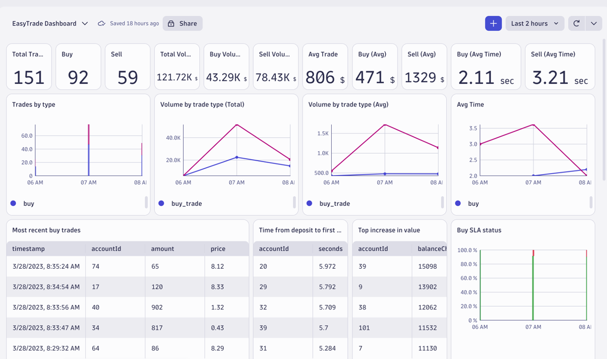

# EasyTrade

Example DQL statements for the Dynatrace EasyTrade demo application.

 

## Count of unique BIZ_EVENTs
```
fetch events
| filter event.kind == "BIZ_EVENT" and contains(event.type,"com.easytrade")
| summarize count=count(), by: {event.kind, event.type, event.group_label}
| fields event.type, count
| sort count desc
```

## Total trades
```
fetch bizevents
| filter event.type == "com.easytrade.sell-assets" or event.type == "com.easytrade.buy-assets"
| summarize Total = count()
```

## Total dollar volume
```
fetch bizevents
| filter event.type == "com.easytrade.sell-assets" or event.type == "com.easytrade.buy-assets"
| summarize Dollars =  round(sum(toDouble(amount)*toDouble(price)))
```

## Trades by type
```
fetch bizevents
| filter event.type == "com.easytrade.sell-assets" or event.type == "com.easytrade.buy-assets"
| parse event.type, "'com.easytrade.' ALPHA:tradeType"
| summarize buy = countif(tradeType == "buy"), sell = countif(tradeType == "sell"), by:{bin(timestamp, 1h)}
```

## Volume by trade type (Total)
```
fetch bizevents
| filter event.type == "com.easytrade.sell-assets" or event.type == "com.easytrade.buy-assets"
| parse event.type, "'com.easytrade.' ALPHA:tradeType"
| summarize trade = round(sum(toDouble(amount)*toDouble(price))), by:{bin(timestamp, 1h),alias:{timestamp},tradeType}
| sort timestamp, direction:"descending"
```

# Buy Time Average
```
fetch bizevents
| filter event.provider == "frontendreverseproxy"
| sort timestamp, direction:"descending"
| filter event.type == "com.easytrade.buy.start" or event.type == "com.easytrade.buy.finish" 
| fieldsAdd buy_raw_ts = if(event.type == "com.easytrade.buy.start", (timestamp))
| fieldsAdd buy_start_ts = if(event.type == "com.easytrade.buy.start", toLong(timestamp))
| fieldsAdd buy_finish_ts = if((event.type == "com.easytrade.buy.finish" and status == "finished"), toLong(timestamp))
| summarize first_buy_raw_ts = takefirst(buy_raw_ts), first_buy_start_ts = takeFirst(buy_start_ts), first_buy_finish_ts = takeFirst(buy_finish_ts), by:{dt.rum.session.id}
| fieldsAdd time_buy_from_start_to_finish = (first_buy_finish_ts - first_buy_start_ts)/(1000000000.0)
| filter time_buy_from_start_to_finish > 0
| summarize buy = round(avg(time_buy_from_start_to_finish),decimals:2)
```

## Top increase in value
```
fetch bizevents|filter event.provider == "www.easytrade.com"
| filter event.type == "com.easytrade.withdraw-money" or event.type == "com.easytrade.deposit-money"
| fieldsAdd amount_withdrawal = if(event.type=="com.easytrade.withdraw-money", toDouble(amount), else:0.0)
| fieldsAdd amount_deposit = if(event.type=="com.easytrade.deposit-money", toDouble(amount), else:0.0)
| summarize total_withdrawals = sum(amount_withdrawal), total_deposits = sum(amount_deposit), by:{accountId}
| fieldsAdd balanceChange = round(total_deposits - total_withdrawals,decimals:2)
| filter balanceChange > 0.0
| fields accountId, balanceChange
| sort balanceChange, direction:"descending"
| limit 5
```

## Buy SLA status
```
fetch bizevents
| filter event.provider == "frontendreverseproxy"
| sort timestamp, direction:"descending"
| filter event.type == "com.easytrade.buy.start" or event.type == "com.easytrade.buy.finish"
| fieldsAdd buy_account_id = if(event.type == "com.easytrade.buy.start", (accountId))
| fieldsAdd buy_raw_ts = if(event.type == "com.easytrade.buy.start", (timestamp))
| fieldsAdd buy_start_ts = if(event.type == "com.easytrade.buy.start", toLong(timestamp))
| fieldsAdd buy_finish_ts = if((event.type == "com.easytrade.buy.finish" and status == "finished"), toLong(timestamp))
| summarize accountId = takefirst(buy_account_id) , first_buy_raw_ts = takefirst(buy_raw_ts),first_buy_start_ts = takeFirst(buy_start_ts), first_buy_finish_ts = takeFirst(buy_finish_ts), by:{dt.rum.session.id}
| fieldsAdd time_from_start_to_finish = (first_buy_finish_ts - first_buy_start_ts)/(1000000000.0)
| fieldsAdd sla = if(time_from_start_to_finish >= 2, "NotMet", else: "Met")
| fields first_buy_raw_ts, alias:{timestamp}, sla
| summarize slaStatus = count(), by:{bin(timestamp, 1h),sla}
```

## Most recent sell trades
```
fetch bizevents, from:now()-30m
| filter event.type == "com.easytrade.sell-assets"
| parse event.type, "'com.easytrade.' ALPHA:tradeType"
| fields timestamp, accountId, tradeType, amount, price = round(price, decimals:2), tradeVolume = round(amount * price, decimals:2)
| sort timestamp, direction:"descending"
| limit 5
```
