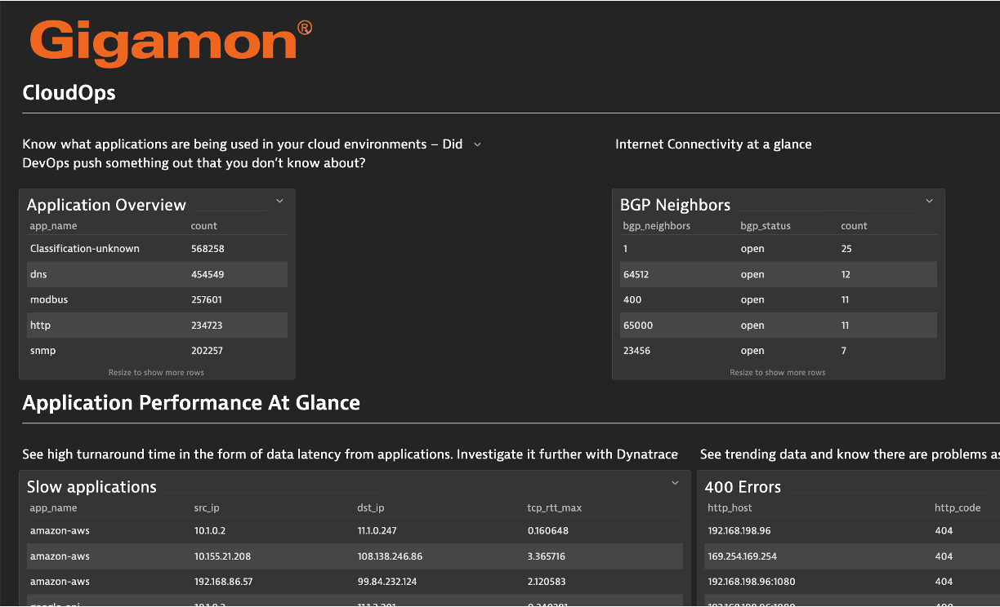

# Gigamon

Example DQL statements for the Gigamon demo environment where JSON logs are generated from their network simulator.  These DQL queries are also behind the examples in this [Gigamon blog](https://blog.gigamon.com/2023/02/14/deep-observability-with-gigamon-and-dynatrace/)

 

# CloudOps

## Application Overview
```
fetch logs| filter isNotNull(app_name)
| summarize count = count(), by:{app_name}
| sort count desc
| limit 10
```

## BGP Neighbors
```
fetch logs
| filter isNotNull(bgp_as)
| summarize count=count(), by: {bgp_status=bgp_message_type, bgp_neighbors=bgp_as}
| fields bgp_neighbors, bgp_status, count 
| sort count desc
```

# Application Performance at a glance

## 400 Errors
```
fetch logs
| filter vendor=="Gigamon" AND in(app_name,"http","https") and isNotNull(http_code) 
| parse http_code, "int:http_code_int"
| filter http_code_int >= 400
| summarize count=count(), by: {http_host,http_code}
| sort count desc
```

## Slow applications
```
fetch logs
| filter vendor=="Gigamon" and in(app_name,"google-api","amazon-aws","ms-teams","salesforce","slack") 
| filter isNotNull( src_ip) and isNotNull( dst_ip) and isNotNull( tcp_rtt)
| parse tcp_rtt_app, "double:tcp_rtt_app_double"
| filter tcp_rtt_app_double > 2
| summarize tcp_rtt_max=max(tcp_rtt), tcp_rtt_app_max=max(tcp_rtt_app_double), by: {app_name, src_ip , dst_ip}
| fields app_name, src_ip , dst_ip, tcp_rtt_max
| sort app_name, src_ip
```

## Web Access and performance info
```
fetch logs
| filter vendor=="Gigamon" and in(app_name,"http","https")
| filter isNotNull( src_ip) and isNotNull( dst_ip)
| parse http_rtt, "double:http_rtt_double"
| filter http_rtt_double > 5
| fields src_ip, http_rtt_double, dst_ip, http_server, http_uri
| sort src_ip
```

# Application Performance - DNS

## Top DNS Queries
```
fetch logs
| filter vendor=="Gigamon" and app_name=="dns" 
| filter isNotNull( dns_query) and isNotNull( dns_name) and isNotNull( dns_host_addr) and isNotNull( dns_response_time) and isNotNull( dns_ttl)
| summarize count = count(), by:{dns_query}
| sort count desc
| limit 10
```
## DNS Traffic Info
```
fetch logs
| filter vendor=="Gigamon" and app_name=="dns" 
| filter isNotNull( dns_query) and isNotNull( dns_name) and isNotNull( dns_host_addr) and isNotNull( dns_response_time) and isNotNull( dns_ttl)
| summarize count = count(), by:{app_name,src_ip,dst_ip,dns_query,dns_name,dns_host_addr,dns_response_time,dns_ttl}
| sort count desc
| fields app_name,src_ip,dst_ip,dns_query,dns_name,dns_host_addr,dns_response_time,dns_ttl, count
```

## Russian DNS Queries
```
fetch logs
| filter vendor=="Gigamon" and app_name=="dns" and isNotNull( dns_query) and isNotNull( dns_name) and isNotNull( dns_host_addr) and isNotNull( dns_response_time) and isNotNull( dns_ttl)
| filter matchesPhrase(dns_query, ".ru",caseSensitive:FALSE)
| summarize count = count(), by:{app_name,src_ip,dst_ip,dns_query,dns_name,dns_host_addr,dns_response_time,dns_ttl}
| fields app_name,src_ip,dst_ip,dns_query,dns_name,dns_host_addr,dns_response_time,dns_ttl, count
| sort count desc
```

# Application Performance - Packet Transmission

## Degraded Performance
```
fetch logs
|filter vendor=="Gigamon"
|filter app_name != "Classification-unknown" and app_name != "Unknown ssl" and app_name != "Unknown tcp"
|filter isNotNull(tcp_loss_count) and isNotNull(src_ip) and isNotNull(dst_ip)
|fields timestamp, src_ip, dst_ip, app_name, tcp_loss_count, tcp_flag_reset, tcp_flags
|sort src_ip
```
## Due to wrong tcp CRC checksum
```
fetch logs
|filter vendor=="Gigamon"
|filter app_name != "Classification-unknown" and app_name != "Unknown ssl" and app_name != "Unknown tcp" and app_name != "Unknown udp"
|filter isNotNull(tcp_wrong_crc) and isNotNull(src_ip) and isNotNull(dst_ip)
| fields src_ip, dst_ip, app_name, tcp_wrong_crc
| sort src_ip
```


## Due to IP checksum failures
```
fetch logs
|filter vendor=="Gigamon"
|filter app_name != "Classification-unknown" and app_name != "Unknown ssl" and app_name != "Unknown tcp"
|filter isNotNull(src_ip) and isNotNull(dst_ip) and isNotNull(ip_wrong_crc)
|fields src_ip, dst_ip, app_name, ip_wrong_crc
|sort src_ip
```
# Application Security - Compliance

## SSL Versions
```
fetch logs
|filter vendor=="Gigamon"
|filter isNotNull(ssl_protocol_version)
|filterOut matchesValue(ssl_protocol_version,"32535")
| fieldsAdd protocol=if(ssl_protocol_version=="2","SSLv2",else:if(ssl_protocol_version=="772","TLS 1.3",else:if(ssl_protocol_version=="768","SSLv3",else:if(ssl_protocol_version=="769","TLS 1.0",else:if(ssl_protocol_version=="770","TLS 1.1",else:if(ssl_protocol_version=="771","TLS 1.2"))))))
| summarize count=count(), by:{ protocol }
| fields protocol, count
| sort protocol
```

## Deprecated Cipher
```
fetch logs
| filter vendor=="Gigamon" and isNotNull(src_ip) and in(ssl_cipher_suite_id,"47","49310")
| filter isNotNull(ssl_protocol_version)
| summarize count(), by:{ssl_cipher_suite_id,src_ip, dst_ip}
| fieldsAdd ssl_cipher_suite_name=if(ssl_cipher_suite_id=="47","RC4",else:if(ssl_cipher_suite_id=="49310","TLS 1.0"))
| summarize count=count(), by:{ ssl_cipher_suite_name}
| sort count desc
| limit 10
| fields ssl_cipher_suite_name, count
```
## Vulnerable Protocols - SMB
```
fetch logs
|filter vendor=="Gigamon" and isNotNull(smb_version) and isNotNull(app_name)
|summarize count=count(), by: {app_name,smb_version}
| sort smb_version, count desc, app_name
| fields smb_version, app_name, count
```

# Application Security - Risks

## Peer to Peer Application traffic
```
fetch logs
|filter vendor=="Gigamon" and app_name=="edonkey" or app_name=="bittorrent" or app_name == "gnutella"
|filter isNotNull(src_ip) and isNotNull(dst_ip) and isNotNull(tcp_rtt_app)
|summarize count=count(), by: {app_name, src_ip, dst_ip}
|sort app_name desc, count desc
```

## Non standard DNS Port Usage
```
fetch logs
| filter vendor=="Gigamon" and app_name=="dns" and isNotNull( dns_query) and isNotNull( dns_name) and isNotNull( dns_host_addr) and isNotNull( dns_response_time) and isNotNull( dns_ttl) and isNotNull(dst_port)
| filterOut dst_port=="53"
| filterOut dst_port=="5353"
| summarize count=count(), by:{dst_port,dns_name, dns_query}
| sort count desc
```

## Crypto mining sessions
```
fetch logs
|filter vendor=="Gigamon" and (app_name=="minexmr-com" or app_name=="bitcoin" or app_name=="monero" )
|summarize count=count(), by:{app_name, src_ip}
| fields app_name, src_ip, count
| sort app_name, count desc
```

## Top DHCP clients
```
fetch logs
|filter vendor=="Gigamon" and isNotNull(dhcp_host_name) 
|summarize count=count(), by: {dhcp_host_name}
| sort count desc
| fields dhcp_host_name, count
```

## Port Spoofing Activity
```
fetch logs
|filter vendor=="Gigamon" and app_name=="ssh" 
|filterOut matchesValue(dst_port, "5355")
|filter dst_port!="22" and dst_port!="23" and dst_port!="53"
|filter src_port!="22" and src_port!="23" and src_port!="53"
|filter isNotNull(src_ip) and isNotNull(dst_ip)
|summarize count=count(), by: {app_name,src_ip,dst_port}
|sort count desc, app_name
| fields app_name, src_ip, dst_port, count
```
